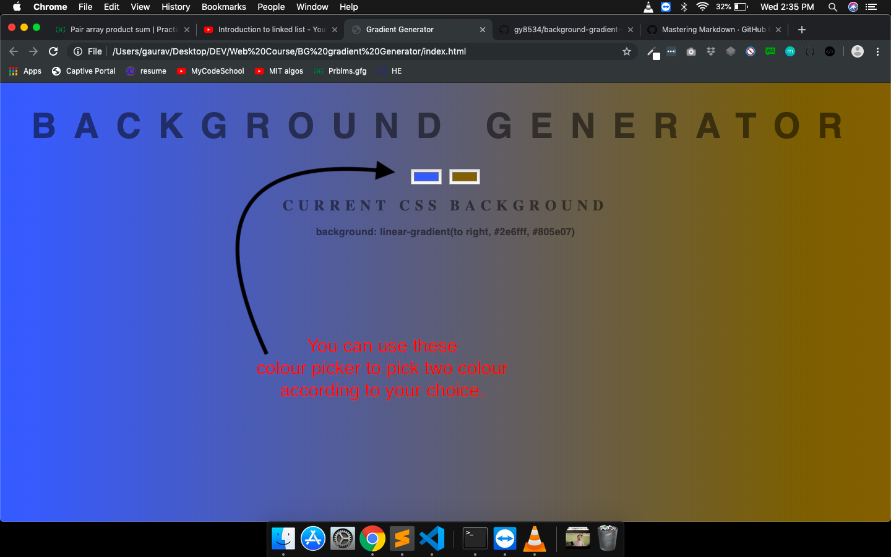

# Background Gradient Generator

This is a simple background gradient generator for web pages.
It gives the value of css property background as `<background: linear-gradient(to right, yellow , green);>`

## How to install?

**No installation required**
Just download all three file and run index.html on your browser.

## How to use?

**Its very simple to use.**

Just use the Color picker to get your favorite gradient.

